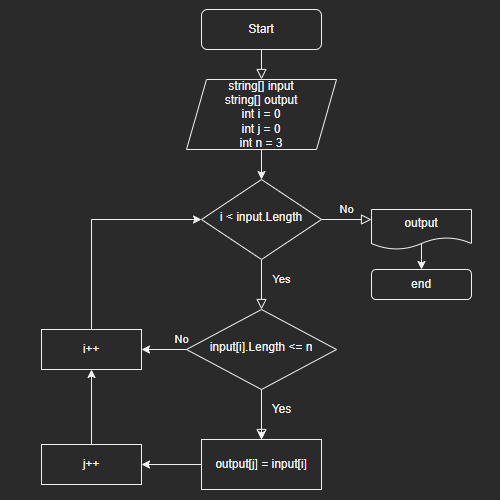

# Final test
___
### Задача

>Написать программу, которая из имеющегося массива строк формирует массив из строк, длина которых меньше либо равна 3 символа. Первоначальный массив можно ввести с клавиатуры, либо задать на старте выполнения алгоритма. При решение не рекомендуется пользоваться коллекциями, лучше обойтись исключительно массивами.

### Алгоритм решения

* Делаем перебор значений из исходного массива
* Проверяем каждое значение из массива на соответствие условию: длина строки меньше или равна трем
* Если строка удовлетворяет условию кладем значение в новый массив
* Повторяем пункты 2 и 3 до тех пор пока не достигнем конца исходного массива
* Возвращаем новый заполненый массив как результат

***Блок-схема алгоритма*** 

___

### Дополнительно по программе

Для запуска программы перейдите в папку solution и запустите команду через терминал:

> `dotnet run`

Далее введите значения через пробел, например:

> hello sun 7 world hi ++

Пример вывода программы:

> [hello, sun, 7, world, hi, ++] -> [sun, 7, hi, ++]